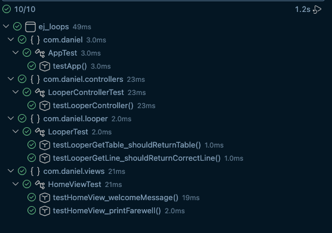
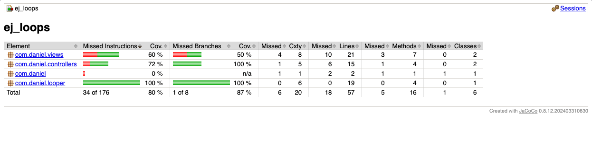

# Factoria F5 exercise - Java Loops

## Description of exercise (es):

Crea una clase que tenga la responsabilidad de crear la tabla de multiplicar de un número. Dado un número entero, n, devuelva su tabla de multiplicar (del 1 al 10).
Cada múltiplo n * i (donde 1 <= i => 10) debe imprimirse en una nueva línea en la forma: n x i = resultado. (Tabla de multiplicación)

## Testing

## Coverage

